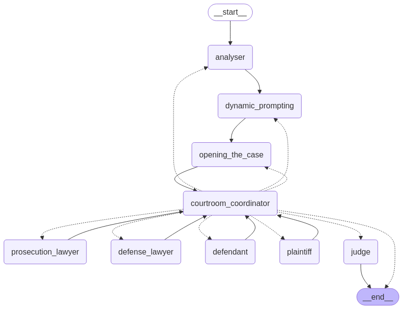

# agents_of_justice

<a href="https://docs.google.com/document/d/1A4M_RekCB74_SG6VDbJOCRz8wJuf4t9P1gz3PHm8apA/edit?usp=sharing"> Google form link    </a> - containing the approach to the project

<h3>Task:</h3>

To determine whether an appeal made by the plaintiff in a case would be passed or not with the help of a courtroom simulation achieved via AI agents. The <a href="utility_files/cases.csv"> cases.csv file contains textual case descriptions on which the prediction is to be done.</a>

<h3>File structure:</h3>

  Entry point - <a href="graph.py"> graph.py </a> - This file defines the structure of the courtroom: THE GRAPH OF THE COURTROOM SIMULATION 
 Agents/tools used in graph.py:
  <ul>
    <li> <a href="case_analyser.py"> case_analyser.py </a> </li>
    <li> <a href="dynamic_prompt_generation.py"> dynamic_prompt_generation.py </a></li>
    <li> <a href="courtRoomCoordinator.py"> courtRoomCoordinator.py </a> </li>
    <li> <a href="prosecution_lawyer.py"> prosecution_lawyer.py </a> </li>
    <li> <a href="defense_lawyer.py"> defense_lawyer.py </a> </li>
    <li> <a href="plaintiff.py"> plaintiff.py </a> </li>
    <li> <a href="defendant.py"> defendant.py </a> </li>
    <li> <a href="judge.py"> judge.py </a> </li>
    <li> <a href="opening_statements.py"> opening_statements.py </a> </li>
  </ul>
   
All system prompts - <a href="config/prompts.py"> prompts.py </a> 

   
For generating outputs of the competition : <a href="output.py"> output.py </a> 

 
 

I have used langgraph for creating the courtroom simulation.

  <strong>LangGraph</strong> is a lightweight framework built on top of LangChain that enables building stateful, multi-agent applications using a graph-based execution model. It's ideal for coordinating LLM-powered agents and managing conversational or task-oriented flows with complex logic.  It follows a graph based structure consisting of nodes and edges , where nodes represent the agents/tools/functions and edges represent the relation between these nodes.

<h3>Here is a graph of the courtroom created by me:</h3>

